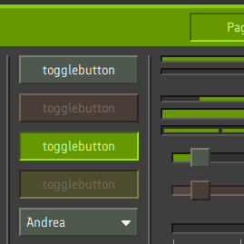
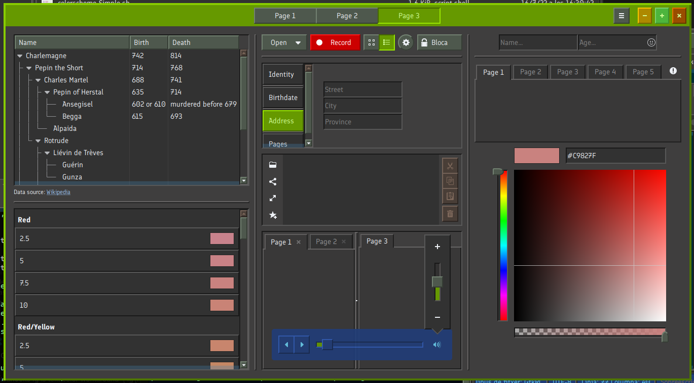

# Skewaita

This is my first serious attempt with a coherent theme for GTK2, GTK3 and GTK4. It is yet anohter skeuomorphic theme (that is, non-flat, that tries to imitate real-world objects and interfaces, like real three-dimensional buttons). 

This theme is based on Adwaita GTK3 and GTK4 (source sasscs!) and built from there. Sources are also available.

GTK2 is based on Clearlooks.

It is a light theme but with gray tones, in order to be easy on the eyes. Accents are bright green, so selected text stays the same color.

I still need to implement a way to easily create different color themes for this base (see [TODO.md](TODO.md))

Big previews:

